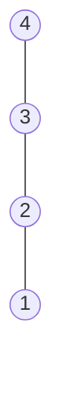

---

sidebar__label: '[Graph] 4. Disjoint Set (Union & Find)'
title: '[Graph] 4. Disjoint Set (Union & Find)'

---

## 什麼是 Disjoint Set? 為什麼需要 Disjoint Set？

我們在處理 Graph 問題時，會需要知道 2 個點是否相連，而我們需要一種有效率的資料結構與演算法來處理這個問題

如以下的範例，我們可以多快地找出以下 2 點之間：
- 0 跟 3 是否相連？
- 1 跟 5 是否相連？
- 7 跟 8 是否相連？


<br /><br />

我們可以利用 Disjoint Set (Union & Find) 這個資料結構來處理這類型問題

<br /><br />

:::caution  Disjoint Set v.s. Union Find
通常我們在做這類型的題目，會聽到 Disjoint Set 跟 Union Find 這兩個名詞，這兩個名詞其實是同一個東西，
但差別在於：
- Disjoint Set：主要在描述資料結構，表示各群不相交的 vertices 集合
- Union Find：主要在描述演算法，分別為 Union 與 Find，Union 用於將兩個點連結，Find 用於找查 vertice 的 root node
:::


<br /><br />


## 相關術語
- **Parent node**： vertex 直接對應的 parent node
- **Root node**：沒有 parent 的 node，或者說自己就是自己的 parent node <br />
  (a node without a parent node; it can be viewed as the parent node of itself.)


<br /><br />

## Disjoint Set 的運作流程

假設我們現在有 0 ~ 9 的 vertices，並且在這個 Graph 的 edges 如下：

```js
[
    [0, 1], [0, 2], [1, 3],
    [4, 8], [5, 6], [5, 7]
]
```

<br /><br />

下面我們就用一個 Slides 的圖示來介紹 Disjoint Set 的運作流程


<div style={{ position: 'relative', width: '100%', maxWidth: '600px', height: '0', paddingBottom: '62.5%' }}>
    <iframe
        src="https://docs.google.com/presentation/d/e/2PACX-1vRgslvFdlKVuZT-Bo7w9A5ZFkwMBNBGvRnoID_mlf37Ffh50AHgWalYz2e5hvALVTtmtOpmDUUDnOb7/embed?start=false&loop=false&delayms=3000"
        frameborder="0"
        allowfullscreen="true"
        mozallowfullscreen="true"
        webkitallowfullscreen="true"
        style={{ position: 'absolute', top: 0, left: 0, width: '100%', height: '100%', maxWidth: '600px', maxHeight: '375px' }}
    >
    </iframe>
</div>


我們透過 edge 連結各點，來將相關連的 vertices 各自歸類到不同的 set，
最後在 Slides 8，我們就可以用最終的 sets 來判斷 2 點是否相連，例如：
- `0, 3`：有相同的 root，所以相連
- `1, 5`：沒有相同的 root，所以不相連
- `7, 8`：沒有相同的 root，所以不相連


<br /><br />

### 資料結構的運作

如果我們把 Disjoint Set 的運作轉成程式的資料解構，我們可以用 1 Array 來表示，其中：
- 每個 index 代表每個 vertex
- 每個 index 的 value 代表每個 vertex 的 parent node


<div style={{ position: 'relative', width: '100%', maxWidth: '600px', height: '0', paddingBottom: '62.5%' }}>
    <iframe
        src="https://docs.google.com/presentation/d/e/2PACX-1vSJYRcP59NzSWdM8gjkXhm-fkncZ8JG4LBroxt6VNoWmqZY3sjBNX4IIN-0jPS6VPFNMnJSAZyHjF_e/embed?start=false&loop=false&delayms=3000"
        frameborder="0"
        allowfullscreen="true"
        mozallowfullscreen="true"
        webkitallowfullscreen="true"
        style={{ position: 'absolute', top: 0, left: 0, width: '100%', height: '100%', maxWidth: '600px', maxHeight: '375px' }}
    >
    </iframe>
</div>

並且，如果我們想知道 2 vertices 是否相連，我們可以透過 2 個 vertices 的 root node 是否相同來判斷，
我們可以利用 parent array 來找到每個 vertex 的 root node，並利用 root node 的 parent 就是自己本身的特性：
以上圖的例子來說：
- ✅ (0,3) 是相連的，因為
    - `findRoot(0) === 0` ：parentArray[0] = 0 --> 0
    - `findRoot(3) === 0` ：parentArray[3] = 1 --> parentArray[1] = 0 --> parentArray[0] = 0 --> 0


- ❌ (1,5) 是不相連的，因為
    - `findRoot(1) === 0` ：parentArray[1] = 0 --> parentArray[0] = 0 --> 0
    - `findRoot(5) === 5` ：parentArray[5] = 5


- ❌ (7,8) 是不相連的，因為
    - `findRoot(7) === 5` ：parentArray[7] = 5 --> parentArray[5] = 5 --> 5
    - `findRoot(8) === 4` ：parentArray[8] = 4 --> parentArray[4] = 4 --> 4


<br /><br />

### 重要 functions

在 Disjoint Set 中，我們有 2 個重要的 functions，可以幫我們解決多數的問題：

- `find`：找到給定 vertex 的 root node
- `union`：將輸入的 2 個 input vertices 連結起來，並設為同一個 root node

<br /><br />

### 兩種實作模式
根據不同的需求，我們可以用不同的實作模式，分別達到最好的 `find` 或 `union` 的效率：

- Implementation with **Quick Find**：
    - `find`：O(1)
    - `union`：O(N)


- Implementation with **Quick Union**：
    - `find`：Ｏ(N)
    - `union`：O(N)


<br /><br /><br />


## Quick Find

如果我們要快速找到指定 vertex 的 root node，我們可以將 array value 改為儲存 Root vertex，
這樣一來，我們就可以在 O(1) 的時間內找到指定 vertex 的 root node

<div style={{ position: 'relative', width: '100%', maxWidth: '600px', height: '0', paddingBottom: '62.5%' }}>
    <iframe
        src="https://docs.google.com/presentation/d/e/2PACX-1vSMJjJNXZXdVzOZyspC6mbQOHzSMlMnQylUC-sBDmYklFiPrUCqy7Il1gQPzlu6ANenLGWVMZTDHG5-/embed?start=false&loop=false&delayms=3000"
        frameborder="0"
        allowfullscreen="true"
        mozallowfullscreen="true"
        webkitallowfullscreen="true"
        style={{ position: 'absolute', top: 0, left: 0, width: '100%', height: '100%', maxWidth: '600px', maxHeight: '375px' }}
    >
    </iframe>
</div>

<br />

但代價是：我們在 union 的時候就需要 O(N) 的時間來更新所有相關的 vertices

以下列的例子來說，我們有兩組 sets，分別以 0, 2 為 root node，當我們連結 0, 2 時，我們也要同時更改 root node 為 2 的所有 vertices，
將其 root node 改為 2

<div style={{ position: 'relative', width: '100%', maxWidth: '600px', height: '0', paddingBottom: '62.5%' }}>
    <iframe
        src="https://docs.google.com/presentation/d/e/2PACX-1vROJrdNWFbZIcpsjK8o1UHgGVcXE1UrvNgIGKeJIhuEVaUGCo82eI5nY-Ji39ZsN7M42sM6Yc3SZdAR/embed?start=false&loop=false&delayms=3000"
        frameborder="0"
        allowfullscreen="true"
        mozallowfullscreen="true"
        webkitallowfullscreen="true"
        style={{ position: 'absolute', top: 0, left: 0, width: '100%', height: '100%', maxWidth: '600px', maxHeight: '375px' }}
    >
    </iframe>
</div>


<br /><br />

### JavaScript 實作

我們主要需要實作三個 methods：
- `find`：找到指定 vertex 的 root node
- `union`：將輸入的 2 個 input vertices 連結起來，並設為同一個 root node
- `connected`：確認兩點是否相連

<br />

```js
class UnionFind {
    root = [];
    
    // 一開始先預設每個 vertex 的 root node 為自己
    constructor(size) {
        for (let i = 0; i < size; i++) {
            this.root[i] = i;
        }
    }

    // 直接回傳 root array 的值
    find(x) {
        return this.root[x];
    }

    // 1. 先找到 x, y 的 root node
    // 2. 將 y 的 root node 設為 x 的 root node
    // 3. 將 root node 為 y 的其他 vertices 的 root node 也一起更新成 x 的 root node
    union(x, y) {
        const rootX = this.find(x);
        const rootY = this.find(y);

        if (rootX !== rootY) {
            this.root[y] = rootX;

            for (let i  = 0; i < this.root.length; i++) {
                if (this.root[i] === rootY) {
                    this.root[i] = rootX;
                }
            }
        }
    }

    // 確認兩點是否相連，透過 2 vertices 的 root node 來判斷
    connected(x, y) {
        return this.find(x) === this.find(y);
    }
}
```

<br />

### Complexity

對於 Quick Find，`find` 可以達到 O(1) 的效率，但 `union` 需要檢查所有 vertices 的 root node 是否需要更改，需要 O(N) 的時間

<table>
    <thead>
        <tr>
            <th></th>
            <th>Union-find Constructor</th>
            <th>Find</th>
            <th>Union</th>
            <th>Connected</th>
        </tr>
    </thead>
    <tbody>
        <tr>
            <td><strong>Time Complexity</strong></td>
            <td>O(N)</td>
            <td>O(1)</td>
            <td>O(N)</td>
            <td>O(1)</td>
        </tr>
    </tbody>
    <tbody>
        <tr>
            <td><strong>Space Complexity</strong></td>
            <td colSpan={4}>O(N)</td>
        </tr>
    </tbody>
</table>

<br /><br />

## Quick Union

如果我們要快速連結 2 vertices，我們保持 parent array 的值為 parent node，會是最有效的方式

如下圖中，當我們連結 `0`, `4` 時，我們只需要將 `4` 的 parent node 設為 0，而不需要更新其他 vertices 的 parent node，在 union 中減少非常多的操作

<div style={{ position: 'relative', width: '100%', maxWidth: '600px', height: '0', paddingBottom: '62.5%' }}    >
    <iframe
        src="https://docs.google.com/presentation/d/e/2PACX-1vR6qjxf3OB3uoaFIqhalEgTDcOKD3M9Jard-vCbDHzsgcWDeVDKI3Tl2T7bFiK3716omx79X-VktYbK/embed?start=false&loop=false&delayms=3000"
        frameborder="0"
        allowfullscreen="true"
        mozallowfullscreen="true"
        webkitallowfullscreen="true"
        style={{ position: 'absolute', top: 0, left: 0, width: '100%', height: '100%', maxWidth: '600px', maxHeight: '375px' }}
    >
    </iframe>
</div>


### JavaScript 實作

我們需要實作三個 methods 跟 Quick Find 相同，主要是 highlight 的部分實作上有差別：
- `find`：找到指定 vertex 的 root node
- `union`：將輸入的 2 個 input vertices 連結起來，並設為同一個 root node
- `connected`：確認兩點是否相連

<br />

```js
class UnionFind {
    root = [];

    constructor(size) {
        for (let i = 0; i < size; i++) {
            this.root[i] = i;
        }
    }

    // 一直去找尋 parent node，直到 parent node 就是自己本身
    find(x) {
        // highlight-start
        while (this.root[x] !== x) {
            x = this.root[x];
        }

        return x;
        // highlight-end
    }

    // 1. 先找到 x, y 的 root node
    // 2. 將 y 的 root node 設為 x 的 root node
    union(x, y) {
        // highlight-start
        const rootX = this.find(x);
        const rootY = this.find(y);

        if (rootX !== rootY) {
            this.root[y] = rootX;
        }
        // highlight-end
    }

    // 確認兩點是否相連，透過 2 vertices 的 root node 來判斷
    connected(x, y) {
        return this.find(x) === this.find(y);
    }
}
```

<br />

### Complexity


對於 Quick Union，`find` 需要一直去找尋 parent node，直到 parent node 就是自己本身，需要 O(N) 的時間，但這是 worst case 的狀況，如下圖，
而 `union` 因為用到了 `find` method，所以時間複雜度也是 O(N)



<table>
    <thead>
        <tr>
            <th></th>
            <th>Union-find Constructor</th>
            <th>Find</th>
            <th>Union</th>
            <th>Connected</th>
        </tr>
    </thead>
    <tbody>
        <tr>
            <td><strong>Time Complexity</strong></td>
            <td>O(N)</td>
            <td>O(N)</td>
            <td>O(N)</td>
            <td>O(N)</td>
        </tr>
    </tbody>
    <tbody>
        <tr>
            <td><strong>Space Complexity</strong></td>
            <td colSpan={4}>O(N)</td>
        </tr>
    </tbody>
</table>


<br /><br />

### Quick Union vs Quick Find

若要從 0 組到 n 的 union：

<table>
    <thead>
        <tr>
            <th></th>
            <th>Find</th>
            <th>Union</th>
        </tr>
    </thead>
    <tbody>
        <tr>
            <td><strong>Quick Find</strong></td>
            <td>O(1)</td>
            <td>N * O(N) === O(N^2)</td>
        </tr>
    </tbody>
    <tbody>
        <tr>
            <td><strong>Quick Union</strong></td>
            <td>O(N) (In worst case)</td>
            <td>N * O(N) === O(N^2) (In worst case)</td>
        </tr>
    </tbody>
</table>

<br /><br />

平均下來

> **Quick Union 的效率會比 Quick Find 來得好**


<br /><br />

## Quick Union Optimizations

由於 Quick Union 在不管在 `find` 或 `union` 的 worst case 的狀況下，會需要 O(N) 的時間，我們希望可以再進一步優化：
我們有以下兩種優化方法：
- Union by Rank：針對 `union` 的時間複雜度做優化
- Path Compression：針對 `find` 的時間複雜度做優化

我們就來一一介紹

<br /><br />

### Union by Rank

如果我們在 `union` 時沒有特別處理，在最壞的情況下，我們的 tree 會變成一個 linked list，這樣一來，`find` 的時間複雜度就會變成 O(N)

<div style={{ position: 'relative', width: '100%', maxWidth: '600px', height: '0', paddingBottom: '62.5%' }}>
    <iframe
        src="https://docs.google.com/presentation/d/e/2PACX-1vRt1XoAmAqkD7xESTw9C-gqwMZKCq_E3EhdgjDWxsrrMX5nFuqBe-kjw_O8A8hRXD6QqHI1N2pvnqqF/embed?start=false&loop=false&delayms=3000"
        frameborder="0"
        allowfullscreen="true"
        mozallowfullscreen="true"
        webkitallowfullscreen="true"
        style={{ position: 'absolute', top: 0, left: 0, width: '100%', height: '100%', maxWidth: '600px', maxHeight: '375px' }}
    >
    </iframe>
</div>

但我們可以利用一些技巧，在 `union` 做一些判斷，讓連接後的 graph 的廣度及深度更平衡，
這樣在進行 `find` 時，效率會更好，進而間接優化 `union` 的時間複雜度

方法很簡單，如下：
1. 我們先得出出兩個 set 的深度
2. 以深度較深的 set 的 root node 為基準，將深度較淺的 set 連接到深度較深的 set 上

<div style={{ position: 'relative', width: '100%', maxWidth: '600px', height: '0', paddingBottom: '62.5%' }}>
    <iframe
        src="https://docs.google.com/presentation/d/e/2PACX-1vQe3AZVwjj6IijEkK7c-Mk6BOMx6EFZrKwekZQO_iNls9giDp4BR9j2QYANgcfICKDmFR5eJED72eN0/embed?start=false&loop=false&delayms=3000"
        frameborder="0"
        allowfullscreen="true"
        mozallowfullscreen="true"
        webkitallowfullscreen="true"
        style={{ position: 'absolute', top: 0, left: 0, width: '100%', height: '100%', maxWidth: '600px', maxHeight: '375px' }}
    >
    </iframe>
</div>


這樣我們就可以避免最壞的 O(N) 的狀況

<br /><br />

#### JavaScript 實作

1. 宣告一個 rank array，用來儲存每個 vertex 的深度
2. 先預設每個 vertex 的深度為 1
3. 在 `union` 時，比較兩個 set 的深度，
    1. 將深度較淺的 set 連接到深度較深的 set 上
    2. 如果深度相同，則將其中一個 set 連接到另一個 set 上，並將被接上的 vertex rank 加 1

```js
class UnionFind {
	root = [];
    // highlight-start
	rank = [];
    // highlight-end

	constructor(size) {
		for (let i = 0; i < size; i++) {
			root[i] = i;
            // highlight-start
			rank[i] = 1;	
            // highlight-end
		}
	}

	union(x, y) {
		const rootX = this.find(x);
		const rootY = this.find(y);

		if (rootX !== rootY) {
			// 看哪邊較大，就設哪邊為 root node
			// 如果兩邊一樣大，那我們就隨邊設一邊為 root node，並且將 rank +1，表示會再多 1 的高度
            // highlight-start
			if (rank[rootX] > rank[rootY]) {
				root[rootY] = rootX;
			} else if (rank[rootX] < rank[rootY]) {
				root[rootX] = rootY;
			} else {
				root[rootY] = rootX;
				rank[rootX] += 1;
			}
            // highlight-end
		}
	}

}
```

<br /><br />

#### Complexity

- *Time Complexity*
    - 對於 `union-find`，我們需要建立 2 個 size N 的 array
    - 對於 `find`，在最糟的情況下，我們重複連結深度相同的 graph，graph height 最多是 log (N) + 1，所以 `find` 的時間複雜度是 O(log N)
    - 對於 `union` 和 `connected`，我們需要先 `find` 2 個 vertices 的 root node，所以時間複雜度是 O(log N)

<br />

- *Space Complexity*
    - 對於 `union-find`，我們需要建立 2 個 size N 的 array


<br /><br />

<table>
    <thead>
        <tr>
            <th></th>
            <th>Union-find Constructor</th>
            <th>Find</th>
            <th>Union</th>
            <th>Connected</th>
        </tr>
    </thead>
    <tbody>
        <tr>
            <td><strong>Time Complexity</strong></td>
            <td>O(N)</td>
            <td>O(log N)</td>
            <td>O(log N)</td>
            <td>O(log N)</td>
        </tr>
    </tbody>
    <tbody>
        <tr>
            <td><strong>Space Complexity</strong></td>
            <td colSpan={4}>O(N)</td>
        </tr>
    </tbody>
</table>

<br /><br />

### Path Compression

除了在 `union` 優化，我們也可以針對 `find` method 做優化，我們可以讓 `find` 的時間複雜度機乎變成跟 Quick Find 一樣，逼近於 O(1)

我們在第一次執行 `find` 時，我們可以利用 Recursion 的技巧，來取得 root node，並將每個 vertex 的 parent node 設為 root node，
這樣一來，在第二次以後執行 `find` 時，時間複雜度就會變成 O(1)

<br />

<div style={{ position: 'relative', width: '100%', maxWidth: '600px', height: '0', paddingBottom: '62.5%' }}    >
    <iframe
        src="https://docs.google.com/presentation/d/e/2PACX-1vSZ-cFpXuS881jDmM_Af3BITW-slXUzB-J5FEWkzsdch04JMlqndqxscd_-QEcoIkvTXrZ-u6KiOqPQ/embed?start=false&loop=false&delayms=3000"
        frameborder="0"
        allowfullscreen="true"
        mozallowfullscreen="true"
        webkitallowfullscreen="true"
        style={{ position: 'absolute', top: 0, left: 0, width: '100%', height: '100%', maxWidth: '600px', maxHeight: '375px' }}
    >
    </iframe>
</div>

<br /><br />

### JavaScript 實作

1. 先取得 x 的 parent node
2. 再利用 Recursion 的技巧，再往下找 parent 的 parent，直到找到 root node
3. 並將 x 的 parent node 設為 root node

```js
class UnionFind {
    ...
    find(x) {
        // highlight-start
        if (this.root[x] === x) {
            return x;
        }

        const parent = this.root[x];
        const rootX = this.find(parent);
        this.root[x] = rootX;

        return rootX;
        // highlight-end
    }
    ...
}
```

<br /><br />

#### Complexity

- *Time Complexity*
    - 對於 `find`，在最好的情況下，也就是只有一層的平衡術，時間複雜度為 O(1)，在最壞的情況下，也就是編成一個 linked list，時間複雜度為 O(N)，
    這樣平均下來，時間複雜度為 O(log N) （詳細可以參考 [Top-Down Analysis of Path Compression](https://www.cs.tau.ac.il/~michas/ufind.pdf)）

<br />

<table>
    <thead>
        <tr>
            <th></th>
            <th>Union-find Constructor</th>
            <th>Find</th>
            <th>Union</th>
            <th>Connected</th>
        </tr>
    </thead>
    <tbody>
        <tr>
            <td><strong>Time Complexity</strong></td>
            <td>O(N)</td>
            <td>O(log N)</td>
            <td>O(log N)</td>
            <td>O(log N)</td>
        </tr>
    </tbody>
    <tbody>
        <tr>
            <td><strong>Space Complexity</strong></td>
            <td colSpan={4}>O(N)</td>
        </tr>
    </tbody>
</table>


<br /><br /><br />


## 優化完的 Quick Union

### JavaScript 實作

```js
class UnionFind {
    root = [];
    rank = [];

    constructor(n) {
        for (let i = 0; i < n; i++) {
            this.root[i] = i;
            this.rank[i] = 1;
        }
    }

    find(x) {
        if (this.root[x] === x) {
            return x;
        }

        const parent = this.root[x];
        const rootX = this.find(parent);
        this.root[x] = rootX;

        return rootX;
    }

    union(x, y) {
        const rootX = this.find(x);
        const rootY = this.find(y);

        if (rootX !== rootY) {
            if (this.rank[rootX] > this.rank[rootY]) {
                this.root[rootY] = rootX;
            } else if (this.rank[rootX] < this.rank[rootY]) {
                this.root[rootX] = rootY;
            } else {
                this.root[rootY] = rootX;
                this.rank[rootX] += 1;
            }
        }
    }

    connected(x, y) {
        return this.find(x) === this.find(y);
    }
}
```

<br /><br />

### Complexity

再經過 Union by Rank 和 Path Compression 的優化後，`find` 的時間複雜度變成 O(α(N))，
其中 α(N) 是 Ackermann function 的反函數，增長速度會非常慢，其值會非常接近於 O(1)，
`union` 和 `connected` 的時間複雜度也會因為 `find` 的時間複雜度變成 O(α(N))

<br />

<table>
    <thead>
        <tr>
            <th></th>
            <th>Union-find Constructor</th>
            <th>Find</th>
            <th>Union</th>
            <th>Connected</th>
        </tr>
    </thead>
    <tbody>
        <tr>
            <td><strong>Time Complexity</strong></td>
            <td>O(N)</td>
            <td>O(α(N))</td>
            <td>O(α(N))</td>
            <td>O(α(N))</td>
        </tr>
    </tbody>
    <tbody>
        <tr>
            <td><strong>Space Complexity</strong></td>
            <td colSpan={4}>O(N)</td>
        </tr>
    </tbody>
</table>

<br /><br />


## 結論
1. Disjoint Set 是用來判斷兩點是否相連
2. 有兩種方法可以實作 Disjoint Set：Quick Find 和 Quick Union，**Quick Union** 的效率比較好
3. Quick Union 可以再進一步優化，利用 Union by Rank 優化 `union` 的時間複雜度，並利用 Path Compression 優化 `find` 的時間複雜度
4. Quick Union 經過優化後，`find` 的時間複雜度變成 O(α(N))，幾乎逼近於 O(1)，`union` 和 `connected` 的時間複雜度也會連帶變成 O(α(N))


<br /><br /><br />

### 參考資料

- [LeetCode Explore - Disjoint Set](https://leetcode.com/explore/learn/card/graph/618/disjoint-set/3881/)

<br /><br /><br />

