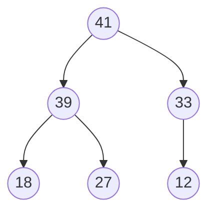
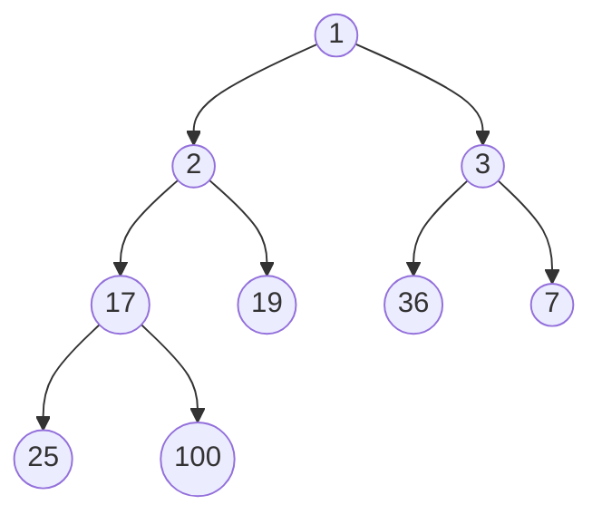
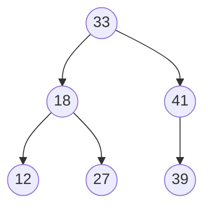

---

sidebar__label: '[LeetCode] 什麼是 Heap?'
title: '[LeetCode] 什麼是 Heap?'

---

## 什麼是 Heap?

Heap 是一種特殊的 Tree，它滿足以下性質：

1. 它是一個完全二叉樹（Complete Binary Tree）
2. parent node 的值總是會一直大於 child node (Max Heap) 或小於 child node (Min Heap)


<br /><br />

範例如下

<br />

### 最大堆（Max Heap）




<br />

- parent nodes 總是比 child nodes 大
- parent node 最多只能有 2 個 childe nodes
- Binary Heap 能越緊密就越緊密 (compact)，每個 node 的 children 會盡可能被填滿，且會從左邊開始填，不像 Binary search tree 可以 node 都在同一邊，像 Linked List 一樣

<br /><br />

### 最小堆（Min Heap）



<br />

- parent nodes 總是比 child nodes 小
- parent node 最多只能有 2 個 childe nodes

<br /><br />

------


❌ Not a Binary Heap




<br />

- 33 < 41
- 41 > 39

<br /> 

沒有所有節點符合**都大於** or **都小於**的規律

<br /><br />

## 我們為什麼需要知道 Heap?

Binary Heap 對後續建立一些顯算法或資料結構非常重要，像是：

1. **Binary Heap 本身**：以 log n 的時間複雜度，來找到最大或最小的值
1. **Priority Queues**：針對自定義的排序規則，來取出前 K 個 (或第 K 個) 最大或最小的優先的值
2. **Graph traversal**：像是：
    1. Dijkstra's Algorithm (單元最短路徑)
    2. Prim's Algorithm (最小生成樹)

<br /><br />


## 如何實作 Heap?

因為 Heap 是 Complete Binary Tree，我們可以用層序遍歷 (Level Order Traversal) 的方式，將其表示為一個陣列，像是：

<br />


<br /><br /><br />

### 如何尋找 children nodes

在上圖，我們可以發現，parent node 跟 children node 是有特殊關係的，我們可以依下面三張圖來觀察：

<br />

1. 當 parent node 的 index 是 0，left child 為 1, right child 為 2


<br /><br /><br /><br />

2. 當 parent node 的 index 是 2，left child 為 5, right child 為 6


<br /><br /><br /><br />

3. 當 parent node 的 index 是 6，left child 為 13, right child 為 14


<br /><br /><br /><br />


根據上述的觀察和數學上的一些歸納，我們可以得到一個結論：

```
若 1 個 node 的位置在 n
- Left child 存在於：2n + 1
- Right child 存在於：2n + 2
```


<br /><br /><br />

### 如何尋找 parent node


反之，我們可以從 find children nodes 的公式，反推 parent node 的公式：

<br />

```js
若 1 個 node 的位置在 n
- Parent node 存在於：Math.floor((n - 1) / 2)
```


<br /><br /><br />


## 結論
1. Heap 是一種特殊的 Complete Binary tree
2. Heap 可以幫助後續的資料結構 & 演算法，像是：
    1. Heap, Priority Queue 用來做 kth 最大/最小值的運算
    2. Graph 的 Traversal 演算法，像是 Dijkstra's Algorithm, Prim's Algorithm
3. Heap 可以用 array 來表示，並藉由特殊關係取得 parent node 或 children node 的 index

<br /><br />

### 參考資料

- [Colt Steele - JavaScript Algorithms and Data Structures Masterclass](https://www.udemy.com/course/js-algorithms-and-data-structures-masterclass)

<br /><br />

