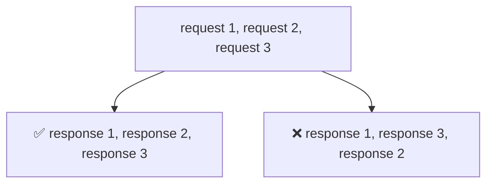

## HTTP 發展史簡介

今天又是新的網路常識主題： **HTTP**，我會就我所知道的來介紹 HTTP 的發展史，主要介紹 HTTP 0.9 ~ HTTP 3.0 的時空背景，每個版本發展的原因，和其究竟帶來了什麼改變

<br />

從大方向來看，HTTP 主要經歷過了幾次大變更：

<table>
  <thead>
    <tr>
      <th align="center">版本</th>
      <th>目的</th>
    </tr>
  </thead>
  <tbody>
    <tr>
      <td align="center">HTTP 0.9 ~ HTTP 1.1</td>
      <td>
        <b>簡單易用的網路協定</b><br />
        主要是為了使 HTTP 協定能快速普及
      </td>
    </tr>
    <tr>
      <td align="center">HTTP 2.0</td>
      <td>
        <b>改善應用層的效能</b><br />
        主要是改善 HTTP head of blocking 造成的效能問題，讓我們可以同時發送多個 HTTP request
      </td>
    </tr>
    <tr>
      <td align="center">HTTP 3.0</td>
      <td>
        <b>改善傳輸層的效能</b><br />
        主要是改善 TCP head of blocking 造成的效能問題，讓我們可以快速切換不同的網路，而不會造成卡頓
      </td>
    </tr>
  </tbody>
</table>

<br /><br />

以下是 HTTP 版本的簡介表格:

| 版本 | 引入年份 | 現在狀態 |
| :---:	| :---:	| :---: |
| HTTP/0.9	| 1991	| ❌ 棄用 |
| HTTP/1.0	| 1996	| ❌ 棄用 |
| HTTP/1.1 | 1997 | ✅ 標準 |
| HTTP/2 | 2015 | ✅ 標準 |
| HTTP/3 | 2022 | ✅ 標準 |
(資料來源： https://en.wikipedia.org/wiki/HTTP#History )


<br /><br />

接者，今天會介紹 HTTP 0.9 ~ HTTP 1.1 的發展史

<br />


## HTTP 0.9: 最簡單的單行協定 (One-Line protocol)

1989 年，「萬維網之父」Tim Berners-Lee 提出了 World Wide Web 的概念，，並在 1990 年開發了 HTTP 協議和 HTML 語言。萬維網的發明徹底改變了人們獲取信息的方式，使信息的傳播變得更加快速和便捷，並在 1991 年正式公佈 HTTP 0.9

此時 HTTP 的版本正是 0.9，只具有以下功能

```bash
$> telnet google.com 80

Connected to 74.125.xxx.xxx

GET /about/

(hypertext response)
(connection closed)
```

<br />

此時候能做的只有
- Client 只能送出 `GET` method，跟要取得的路徑資源
- Server 只能回傳 HTML response

沒有任何的 HTTP header

<br />


## HTTP 1.0: 網路飛快成長的年代
<br />

> **HTTP/1.0 主要解決了網路飛快成長的年代，需要更多的功能面對不同的需求**

<br />

從 1991 年到 1995 年是 HTML 規範的快速共同演化時期，一種被稱為「網頁瀏覽器」的新型軟體的出現，以及面向消費者的公共互聯網基礎設施的出現和快速增長

在此時，基於「萬維網之父」Tim Berner-Lee 的初始瀏覽器原型，國家超級計算應用中心（NCSA, National Center of Supercomputing Applications）的一個團隊決定實施他們自己的版本。於是，**第一個流行的瀏覽器誕生了：NCSA Mosaic**。NCSA 團隊的一位程序員 Marc Andreessen 與 Jim Clark 於 1994 年 10 月合作創立了 Mosaic Communications。**該公司後來改名為 Netscape**，並於 1994 年 12 月推出了 Netscape Navigator 1.0

隨著開始向大眾普及，以及各類需求飛增，很快暴露了 HTTP 0.9 的許多基本限制：我們需要一個功能更豐富的協定，不僅可以提供 HTML，還能提供有關請求和回應的更豐富的 metadata，實現內容協商等功能，並在 1996 年正式公佈 HTTP 1.0

<br />

此時 HTTP 1.0 的範本如下：
```bash
$> telnet website.org 80

Connected to xxx.xxx.xxx.xxx

# Request
GET /rfc/rfc1945.txt HTTP/1.0  (1)
User-Agent: CERN-LineMode/2.15 libwww/2.17b3
Accept: */*

# Response
HTTP/1.0 200 OK  (2)
Content-Type: text/plain (3)
Content-Length: 137582
Expires: Thu, 01 Dec 1997 16:00:00 GMT (4)
Last-Modified: Wed, 1 May 1996 12:45:26 GMT (4)
Server: Apache 0.84

(plain-text response)
(connection closed)
```

<br />

此時，我們多了以下功能：
- 更多的 HTTP method：`POST`, `HEAD`
- 提供使用的 HTTP version (1)
- 提供 response status (2)
- 可以發送不同種類的內文，包括 HTML file, plain text file, image, 還有其他內文類型.
- 多行的 HTTP content，包括：
    - Cache related (4)
    - Authorization
- Connection: keep-alive 支持長連接，但非標準

已經算是具有非常多功能的協定了，還包含以下一些常用到的功能

<br />

### Cache 部分
HTTP 1.0 的緩存控制機制主要依靠 Last-Modified 和 Expires 這兩個 header 來控制資源的緩存
- **Last-Modified**：表示資源的最後修改時間
- **Expires**：表示資源的過期時間

**主要是利用時間來控制 cache 的存取**
(關於 HTTP cache 的部分，後面會再詳細介紹)

<br />

### Authorization 權限設定部分

```html
Authorization: <username>:<password>
```

<br />

其中，username 表示用戶名，password 表示密碼，例如，以下是 HTTP 1.0 中 Authorization header 的示例：

```html
Authorization: benson_chen:benson123456
```

<br />

HTTP 1.0 的 Authorization header 存在以下缺點：
- 安全性不高：用戶名和密碼明文傳輸，容易被截獲
- 不靈活：只能使用 Basic 方式進行授權

此時的 Authorization 功能還是算簡陋，也很容易被竊取，跟我們現在的使用情境還有一段距離

<br /><br /><br />

雖然已經有這麼豐富的功能，**但是 HTTP 1.0 其實還不是個正式的網路標準協定**（詳見 [RFC 1945](https://www.rfc-editor.org/rfc/rfc1945#:~:text=RFC%201945%20HTTP%2F1,HTTP%2F1.0))

<br />

因此，制定 HTTP 協議相關的組織仍在致力於制定網路的標準協定，經過了 4 年的努力後，才誕生出了第一個標準的網路協定：HTTP 1.1

<br /><br />


## HTTP 1.1: 標準的網路協定

<br />

> **HTTP/1.1 主要制定了網路傳輸協定標準，且針對效能進行諸多改良**

<br />

此標準於 1997 年 1 月正式發布，大約在 HTTP/1.0 發布後的六個月。然後，在 1999 年 6 月，大約兩年半後，一些改進和更新被納入標準，並作為 RFC 2616 發布

HTTP/1.1 標準解決了早期版本中發現的許多協議模糊性，擴展了許多既有功能，並引入了一些關鍵的性能優化：

<table>
  <thead>
    <tr>
      <th align="center">優化項目</th>
      <th>內容</th>
    </tr>
  </thead>
  <tbody>
    <tr>
      <td>HTTP method</td>
      <td>擴展 `PUT`, `DELETE`, `OPTIONS` HTTP methods</td>
    </tr>
    <tr>
      <td>HTTP Authorization header</td>
      <td>
        新增 Authorization 的 schema，使 HTTP 可以有不同類型的密碼
      </td>
    </tr>
    <tr>
      <td>效能方面</td>
      <td>
        <ul>
          <li>Keep-Alive connections</li>
          <li>擴展 caching 機制</li>
          <li>新增 request pipelining 機制</li>
        </ul>
      </td>
    </tr>
  </tbody>
</table>

<br /><br />

HTTP/1.1 的樣本如下：
```bash
$> telnet website.org 80
Connected to xxx.xxx.xxx.xxx

# Request 1
GET /index.html HTTP/1.1 
Host: website.org
User-Agent: Mozilla/5.0 (Macintosh; Intel Mac OS X 10_7_4)... (snip)
Accept: text/html,application/xhtml+xml,application/xml;q=0.9,*/*;q=0.8
Accept-Encoding: gzip,deflate,sdch
Accept-Language: en-US,en;q=0.8
Accept-Charset: ISO-8859-1,utf-8;q=0.7,*;q=0.3
Cookie: __qca=P0-800083390... (snip)

# Response 1
HTTP/1.1 200 OK 
Server: nginx/1.0.11
Connection: keep-alive
Content-Type: text/html; charset=utf-8
Via: HTTP/1.1 GWA
Date: Wed, 25 Jul 2012 20:23:35 GMT
Expires: Wed, 25 Jul 2012 20:23:35 GMT
Cache-Control: max-age=0, no-cache
Transfer-Encoding: chunked

100 
<!doctype html>
(snip)

100
(snip)

0 

# Request 2
GET /favicon.ico HTTP/1.1 
Host: www.website.org
User-Agent: Mozilla/5.0 (Macintosh; Intel Mac OS X 10_7_4)... (snip)
Accept: */*
Referer: http://website.org/
Connection: close 
Accept-Encoding: gzip,deflate,sdch
Accept-Language: en-US,en;q=0.8
Accept-Charset: ISO-8859-1,utf-8;q=0.7,*;q=0.3
Cookie: __qca=P0-800083390... (snip)

# Response 2
HTTP/1.1 200 OK 
Server: nginx/1.0.11
Content-Type: image/x-icon
Content-Length: 3638
Connection: close
Last-Modified: Thu, 19 Jul 2012 17:51:44 GMT
Cache-Control: max-age=315360000
Accept-Ranges: bytes
Via: HTTP/1.1 GWA
Date: Sat, 21 Jul 2012 21:35:22 GMT
Expires: Thu, 31 Dec 2037 23:55:55 GMT
Etag: W/PSA-GAu26oXbDi

(icon data)
(connection closed)
```

<br />


### 擴展的 Authorization 機制
- **增加了 Bearer 方式**：<br />
Bearer 方式是 HTTP 1.1 中新增的一種授權方式，它使用令牌來代替用戶名和密碼。Bearer 方式更加安全和方便，因此在 HTTP 1.1 中被廣泛使用

- **增加了 Digest 方式**：<br />
Digest 方式是 HTTP 1.1 中新增的一種授權方式，它使用哈希算法來驗證用戶名和密碼。Digest 方式更加安全，因此在一些安全敏感的應用中被使用

- **增加了 Authorization header 的格式校驗**：<br />
HTTP 1.1 對 Authorization header 的格式進行了校驗，以防止錯誤的授權信息

<br />

具體來說，HTTP 1.1 中 Authorization header 的格式如下：

```html
Authorization: <scheme> <credentials>
```

其中，scheme 表示授權方式，credentials 表示授權信息

<br /><br />


### 擴展的 Caching 機制
- **增加了 Etag 頭部**：<br />
Etag 頭部是資源的唯一標識符，可以用來代替 Last-Modified 頭部。Etag 頭部可以有效防止資源被誤判為過期。<br /><br />
- **引入了 Cache-Control 頭部**：<br />
Cache-Control 頭部可以用來指定資源的緩存策略，例如是否可以緩存、緩存的時間等。Cache-Control 頭部可以讓客戶端和服務器更加靈活地控制資源的緩存。<br /><br />
- **引入了 Vary 頭部**：<br />
Vary 頭部可以用來指定影響資源緩存的因素，例如客戶端的 IP 地址、Cookie 等。Vary 頭部可以防止資源被緩存到客戶端的本地，從而提高資源的安全性
<br />


<br /><br />


### TCP Keep-Alive

<figure>
  
</figure>

<br />

在之前提到的 TCP connection 中，每一次的建立 TCP 連結都需要經過三次握手的複雜過程，因此會大大增加 network request 所需要的時間，在 HTTP/1.1 中，每次的 request 已經都預設為讓 TCP Keep-Alive，使得下一次發送 request 時，不需要再重新建立一次 TCP connection，大大節省 network request 的時間


<br />

### Request Pipelining

<figure>
  
</figure>

允許同時發出多個 HTTP request，不用等待上一個 request 的 response

雖然理想很豐滿，但現實很骨感，實際上
- 現實中 Pipelining 要正確地實現非常棘手，因為 proxy 很難正確的控制 pipelining
- 雖然不用等待上一個 response，但 response 回傳一定要按順序，例如：


<br /><br /><br />

導致 **Head of blocking** 的問題產生，因此有了後續 HTTP/2.0 來進行優化，這部分明天繼續～


<br /><br />


## 今天小結
- 瞭解 HTTP 0.9 ~ HTTP 1.1 的主要功能是為了使網際網路快速普及，設計上簡單易用為目的
- 瞭解 HTTP 0.9 只提供 Client `GET` method，和 Server 回傳 HTML response，只有最簡單的功能
- 瞭解 HTTP 1.0 為了因應 Web browser 的誕生，和網路的快速發展，多了許多功能因應多樣需求，但還不是正式的網路傳輸標準協定
- 瞭解 HTTP 1.1 完善了 HTTP 1.0 的功能，包括 Authorization, Caching 等，並做了諸多效能優化，包括 TCP Keep-Alive, Compressing, Pipelining，並且是正式的網路傳輸標準協定


<br /><br />


### 參考資源
- [O'Reilly - HTTP: Brief History of HTTP - High Performance Browser Networking (O'Reilly) (hpbn.co)](https://hpbn.co/brief-history-of-http/)
- [Web.dev - Introduction to HTTP/2](https://web.dev/performance-http2/#server-push)
- [ByteByteGo - HTTP/1 to HTTP/2 to HTTP/3 - YouTube](https://www.youtube.com/watch?v=a-sBfyiXysI&t=158s)
- [Wikipedia - HTTP](https://en.wikipedia.org/wiki/HTTP#History)


<br /><br />