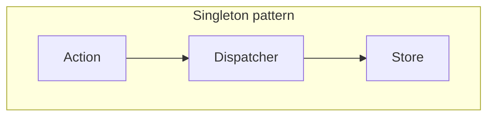
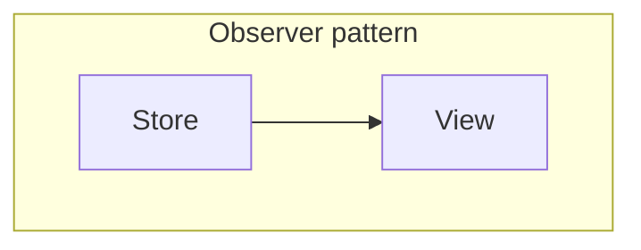

## 為什麼我們需要 Flux?

### 問題：混亂的資料流向

- 在前端中，我們常用的 MVC 的每個部分資料流向都可以是雙向的，若沒有良好的慣例或維護，就會造成資料流難以掌控，後續專案難以維護

( 有維護過 jQuery 專案的就知道 🤪 )

<figure>
  
  <figcaption>(圖片來源：https://tw.alphacamp.co/blog/mvc-model-view-controller)</figcaption>
</figure>

<br />

<figure>
  
  <figcaption>(圖片來源：https://www.youtube.com/watch?v=nYkdrAPrdcw&list=PLb0IAmt7-GS188xDYE-u1ShQmFFGbrk0v&t=621s)</figcaption>
</figure>

<br /><br />

- 提供一個前端的概念，讓大家可以遵循，讓大規模的開發和維護上不會有不知道資料流向的問題


<br /><br />

## 什麼是 Flux?

讓 app data 的流向遵循 Unidirectional data flow，以解決 MVC 沒有定義資料流向的，造成維護困難的問題

<figure>
  
</figure>

<br /><br />

同時並在

1. 更改 store state 時，使用 Singleton 且限制只有 action 能更改 state


<br /><br />

2. 更新 View 時，在 Store state 更新時利用 Observer 通知訂閱的 View


<br /><br />

來達成單一資料流向，以下就來一一說明


<br /><br />

### **Singleton**: 限制改變 store 的 state 的方法

利用 store 作為整個 app 的 Singleton Pattern，為整個 app 所有狀態的集合體 & 單一個存在，只能透過 action 去改變 store 的值，限制其存取，讓我們可以透過一個統一的 state 區塊去種整個資料流的更新

<br />

```js
// Actions
const actions = {
	increment: { type: 'INCREMENT' },
	decrement: { type: 'DECREMENT' },
};

// Reducer: manipulate store's state change
const countReducer = (state = initialState, action) => {
	switch (action.type) {
		case actions.increment.type:
			return { count: state.count + 1 };

		case actions.decrement.type:
			return { count: state.count - 1 };

		default:
			return state;
	}
}

// 
dispatch(actinos.increment);
store.getState() // { count: 1 }
```

<br /><br />

### Observer pattern: 通知所有的 view，store state 改變了

在 Redux 的程式原始碼中，實現 `dispatch` 的部分，當利用 reducer 跟 action 產生新的 store state 時，就會通知所有註冊這個 store 的對象，通常是一個 view，或者 React 的一個 Component 等，這便是利用的 Observer pattern 的概念

<br />

```js
const createStore = (myReducer) => {
	let listener = [];
	let currentState = myReducer(undefined, {});

	...

	const dispatch = (action) => {
		currentState = myReducer(currentState, action);

    // highlight-start
		listeners.forEach((listener) => {
			listener();
		});
    // highlight-end
	};

	return {
		getState,
		dispatch,
		subscribe,
	};
};
```

<br /><br />

## 補充: 工廠模式 (Factory pattern) 來產生多個單體(Singleton)

在 Redux 中，沒有限制只能擁有一個 store，反而提供了一個 `createStore` 的 api，讓我們去建立自己的 store，這便是使用了 Factory pattern 的概念

Redux 利用 function programming 的 closure 技巧，來像 Class 一樣保存自己的狀態 & 自己的 listeners

<br />

```js
// highlight-start
const createStore = (myReducer) => {
	let listener = [];
	let currentState = myReducer(undefined, {});
// highlight-end

	const getState = () => {...};
	const dispatch = (action) => {...};
	const subscribe = (newListener) => {...};

	return {
		getState,
		dispatch,
		subscribe,
	};
};
```

<br /><br />

讓每個 store 都可以擁有自己的 Component, view listeners，自己的 action，且每個 store 都是獨立的，不會互相干擾


<br /><br />


## 結論

1. MVC 只是做 separation of concern，但是 Flux 靠著對資料來源的存取限制決定了資料的流動方式，讓我們更可以清楚地了解資料的流向，讓專案在 scaling 時更好維護
2. 對 Singelton 的 store state 做存取的限制，只能用 action 改變，達成資料單一流向的目的
3. 利用 Obeserver pattern 的概念，讓 store 通知所有的 View，通知所有註冊的 React component


<br /><br />


### 參考資料

- [The Mental Model That Helped Me Finally Understand "Flux" - Andy Ray's Blog (andrewray.me)](https://andrewray.me/blog/the-mental-model-that-helped-me-finally-understand-flux)
- [A cartoon guide to Flux. Flux is both one of the most popular… | by Lin Clark | Code Cartoons | Medium](https://medium.com/code-cartoons/a-cartoon-guide-to-flux-6157355ab207)
- [Hacker Way: Rethinking Web App Development at Facebook - YouTube](https://www.youtube.com/watch?v=nYkdrAPrdcw&list=PLb0IAmt7-GS188xDYE-u1ShQmFFGbrk0v&t=621s)
- [Flux 簡單範例程式 (openai.com)](https://chat.openai.com/c/4ccb1384-4d32-410f-bbc9-71295c7bbde7)
- [How to Use Flux to Manage State in ReactJS - Explained with an Example (freecodecamp.org)](https://www.freecodecamp.org/news/how-to-use-flux-in-react-example/)
- [MVC架構是什麼？認識 Model-View-Controller 軟體設計模式 - ALPHA Camp](https://tw.alphacamp.co/blog/mvc-model-view-controller)

<br /><br />