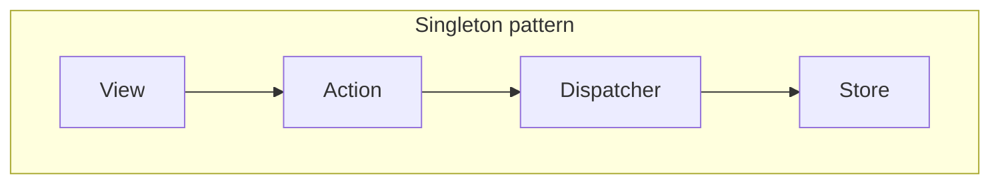
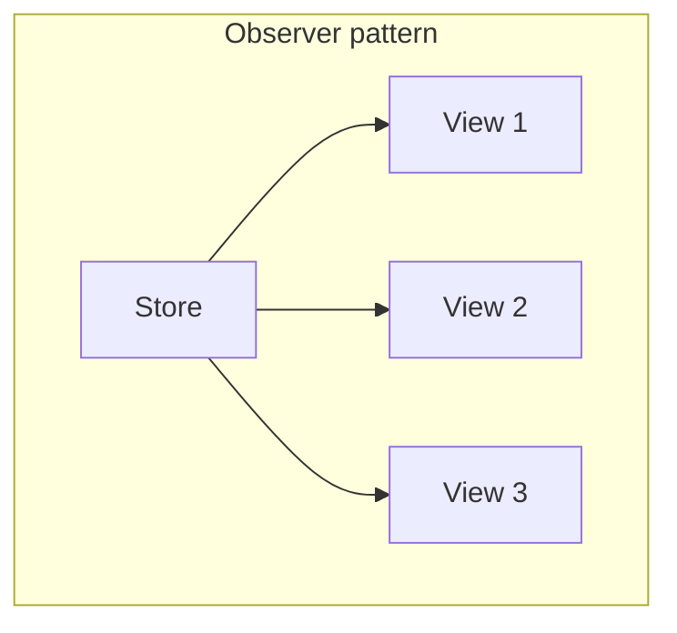

## 為什麼我們需要 Flux?

### 問題：混亂的資料流向

在前端中，我們常用的 MVC 的功能只有幫我們做到關注點分離 (Separate of Concern; Soc)，也就是幫我們把程式碼分成 Model, View, Controller 三個部分而已，
但並沒有限制我們的狀態要存在在哪，並且如何有規律的更改我們的狀態

<figure>
  
  <figcaption>(圖片來源：<a href="https://tw.alphacamp.co/blog/mvc-model-view-controller" target="_blank">MVC架構是什麼？認識 Model-View-Controller 軟體設計模式</a>)</figcaption>
</figure>

<br />
<br />

在 MVC 中的每個部分都可以有自己的狀態，且任部分都可以更改任何位置的狀態，例如 Model 可以改 View 內的狀態，Controller 可以改 Model 的狀態

若沒有良好的慣例或維護，就會造成資料流難以掌控，後續專案難以維護

( 有維護過 jQuery 專案的就知道 🤪 )

<figure>
  
  <figcaption>(圖片來源：<a href="https://www.youtube.com/watch?v=nYkdrAPrdcw&list=PLb0IAmt7-GS188xDYE-u1ShQmFFGbrk0v&t=621s" target="_blank">Hacker Way: Rethinking Web App Development at Facebook</a>)</figcaption>
</figure>

<br /><br />


所以，Flux pattern 就是提供一個概念讓大家可以遵循，讓大規模的開發和維護上不會有不知道資料流向的問題


<br /><br />

## 什麼是 Flux?

讓 app 的資料流向遵循單一資料流 (Unidirectional data flow)，以解決 MVC 沒有定義資料流向的，造成維護困難的問題

<figure>
  
</figure>

<br /><br />

Flux pattern 就我的理解，可以分為兩個階段：	

1. Singelton pattern：先產生一個全域的 Store，限制其存取的方式。
	接者所有的 View 可以透過一個行動 (Action)，並搭配特定的調動者 (Dispatcher)，去改變指定的 Store 裡的狀態

	ex：我們點擊登出按鈕，那我們就移除儲存在全域的登入狀態



<br /><br />

2. Observer pattern：更新 View 時，在 Store state 更新時通知所有訂閱的 View(s)

	ex：所有的頁面知道登入狀態改變了，就都會導回登入頁面



<br /><br />

來達成單一資料流向，以下就來一一說明


<br /><br />

### **Singleton**: 限制改變 store 的 state 的方法

利用 Singleton Pattern 讓整個 app 的 global store 只有一個單一的存在，且只能透過指定的 action 去改變 store 的值，限制其存取，讓我們可以透過一個統一的 state 區塊去種整個資料流的更新

<br />

產生全局單一的 Store，並且限制其存取的方式
```js

// Store's state
const initialState = { count: 0 };

// Store's 處理器 (Reducer): 根據 action 去改變 store 的 state
const countReducer = (state = initialState, action) => {
	switch (action.type) {
		case 'INCREMENT':
			return { count: state.count + 1 };

		case 'DECREMENT':
			return { count: state.count - 1 };

		default:
			return state;
	}
}

const store = createStore(countReducer);
export store;
```

<br />

利用 action 被 dispatch 的方式，去改變 store 的 state

```js
// Update store's state

import store from './store';

// Actions
const actions = {
	increment: { type: 'INCREMENT' },
	decrement: { type: 'DECREMENT' },
};

// Dispatcher dispatch action
store.dispatch(actions.increment);

// store's state changed
store.getState(); // { count: 1 }
```

<br /><br />

### **Observer pattern**: 通知所有的 views，store state 有變化了

在 Redux 的程式原始碼中，實現 `dispatch` 的部分，當利用 reducer 跟 action 產生新的 store state 時，就會通知所有註冊這個 store 的對象，通常是一個 view，或者 React 的一個 Component 等，這便是利用的 Observer pattern 的概念

<br />

```js
const createStore = (myReducer) => {
	let listener = [];
	let currentState = myReducer(undefined, {});

	...

	const dispatch = (action) => {
		currentState = myReducer(currentState, action);

    // highlight-start
		listeners.forEach((listener) => {
			listener();
		});
    // highlight-end
	};

	return {
		getState,
		dispatch,
		subscribe,
	};
};
```

<br /><br />

## 補充: 工廠模式 (Factory pattern) 來產生多個單體(Singleton)

在 Redux 中，沒有限制只能擁有一個 store，反而提供了一個 `createStore` 的 api，讓我們去建立自己的 store，這便是使用了 Factory pattern 的概念

Redux 利用 function programming 的 closure 技巧，來像 Class 一樣保存自己的狀態 & 自己的 listeners

<br />

```js
// highlight-start
const createStore = (myReducer) => {
	let listener = [];
	let currentState = myReducer(undefined, {});
// highlight-end

	const getState = () => {...};
	const dispatch = (action) => {...};
	const subscribe = (newListener) => {...};

	return {
		getState,
		dispatch,
		subscribe,
	};
};
```

<br /><br />

讓每個 store 都可以擁有自己的 Component, view listeners，自己的 action，且每個 store 都是獨立的，不會互相干擾


<br /><br />


## 結論

1. MVC 只是做 separation of concern，但是 Flux 靠著對資料來源的存取限制決定了資料的流動方式，讓我們更可以清楚地了解資料的流向，讓專案在 scaling 時更好維護
2. 對 Singelton 的 store state 做存取的限制，只能用 action 改變，達成資料單一流向的目的
3. 利用 Obeserver pattern 的概念，讓 store 通知所有的 View，通知所有註冊的 React component


<br /><br />


### 參考資料

- [The Mental Model That Helped Me Finally Understand "Flux" - Andy Ray's Blog (andrewray.me)](https://andrewray.me/blog/the-mental-model-that-helped-me-finally-understand-flux)
- [A cartoon guide to Flux. Flux is both one of the most popular… | by Lin Clark | Code Cartoons | Medium](https://medium.com/code-cartoons/a-cartoon-guide-to-flux-6157355ab207)
- [Hacker Way: Rethinking Web App Development at Facebook - YouTube](https://www.youtube.com/watch?v=nYkdrAPrdcw&list=PLb0IAmt7-GS188xDYE-u1ShQmFFGbrk0v&t=621s)
- [Flux 簡單範例程式 (openai.com)](https://chat.openai.com/c/4ccb1384-4d32-410f-bbc9-71295c7bbde7)
- [How to Use Flux to Manage State in ReactJS - Explained with an Example (freecodecamp.org)](https://www.freecodecamp.org/news/how-to-use-flux-in-react-example/)
- [MVC架構是什麼？認識 Model-View-Controller 軟體設計模式 - ALPHA Camp](https://tw.alphacamp.co/blog/mvc-model-view-controller)

<br /><br />