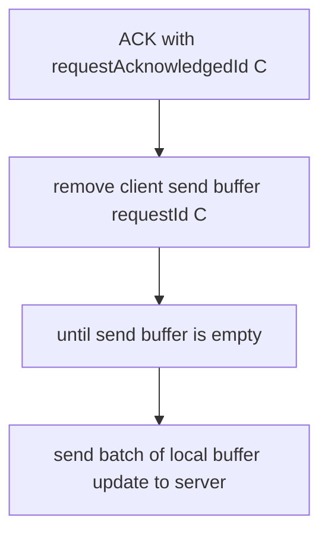

## Interface

For collaborative editing, we will have 2 types of interface:
1. Client to Editor interface
2. Editor to Server interface

<br />

We will focus on the **Editor to Server interface** in this document.

<br />

### Editor to Server interface

Since the collaborative editing is a real-time behavior(WebSocket), the APIs are usually called actions/events.

Here we have 3 types of actions in collaborative editing:

1. Update/Save action
2. Acknowledge action
3. Peer update action

<br />

### Update/Save action

The update/save action is the user's new edit data plan to send to server and store in the document.

here is the Update action payload example:

```ts
{
  "type": "UPDATE",
  "requestId": 19, // increase monotonically by every request from client session start,
  "revision": 100, // current document version when the update is sent
  "operations": [
    {
      "type": "INSERT",
      "nodeId": 30, // help to find the node efficiently in the document node map
      "payload": {
        "characters": "IKEA"
        "index": 4, // the operation occur position from the node start
      }
    },
    {
      "type": "INSERT",
      "nodeId": 31, // help to find the node efficiently in the document node map
      "payload": {
        "characters": "Shark"
        "index": 2, // the operation occur position from the node start
      }
    },
  ]
}
```


<br />

### Acknowledge action

This action is used to acknowledge the client the update is received and stored in the document.

Then remove the corresponding request from the send buffer.

Once the send buffer is empty, the client will send the batch of local buffer update to server.



<br />

here is the Acknowledge action payload example:

```js
{
  "type": "ACK",
  "requestIdAcknowledged": 2,
  "requestId": 3,
  "revision": 147
}
```

<br />


### Peer update action

This action is used to notify the client there are new updates from peers.

here is the Peer update action payload example:

```js
{
  "type": "PEER_UPDATE",
  "revision": 101,
  "userId": 6543, // User who made the update
  "operations": [
    {
      "type": "INSERT",
      "nodeId": 24, // Needed in a document context to identify the node to modify
      "payload": {
        "characters": "Goodbye",
        "index": 8
      }
    },
    {
      "type": "INSERT",
      "nodeId": 25,
      "payload": {
        "characters": " see you next time",
        "index": 4,
      }
    }
  ]
}

```

<br /><br />


## References
- [GreatFrontend - Google Docs](https://www.greatfrontend.com/questions/system-design/collaborative-editor-google-docs#interface-definition-api)


<br /><br />