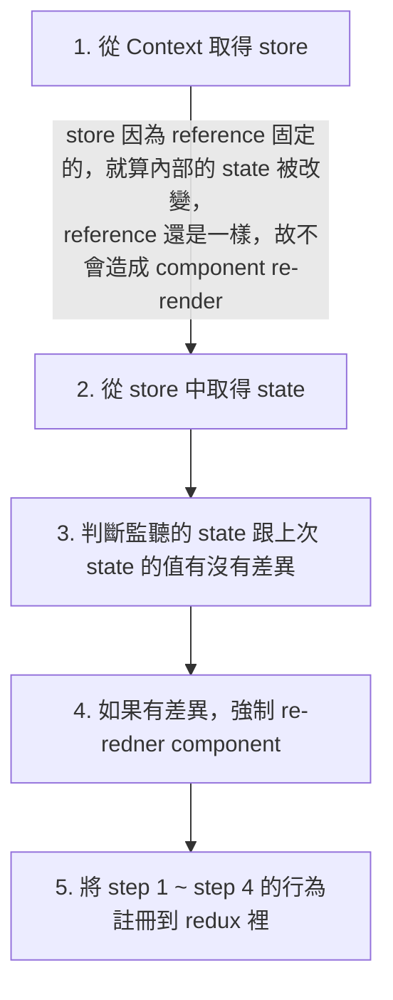
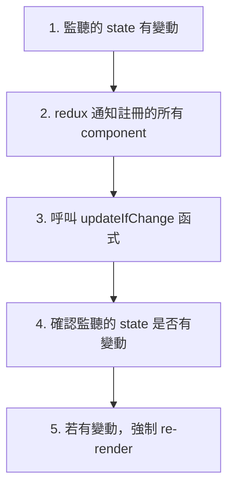

:::info 原始碼在這，歡迎來玩～
https://github.com/MechaChen/simple-react-redux
:::


## 前言：Context 的效能問題

過去直接使用 Context，會造成 Child component 一直 re-render，就算該 component 實際用到的值沒有變更，還是會造成 re-render

<br />

以一個有 3 個 Counters，都包在 Context 底下的情境為例，Counters 條件如下
- 2 個 Counters 的狀態使用 Context 提供的 count1, count2 state
- 1 個 Counter 有自己的 state

<br />

<figure>
  
</figure>

<br />

若我們來實際操作的話，就會有以下的效果

<iframe width="720" height="405" src="https://www.youtube.com/embed/ph8fLb2mE_Y?si=DNC1FN8zcREhUczH" title="YouTube video player" frameborder="0" allow="accelerometer; autoplay; clipboard-write; encrypted-media; gyroscope; picture-in-picture; web-share" allowfullscreen></iframe>

<br /><br />

我們就會發現
1. 當我對 Context 中的 count1 做加減時，整個 Context component, Counter1, Counter2 都會 re-render
2. count2 同上

<br /><br />

我們先來看看程式碼片段，來了解為什麼會這樣

```jsx
const [count1, setCount1] = useState(0);
const [count2, setCount2] = useState(0);

// 當 count1, count2 有變動時， useMemo 就會產生新的 contextValue
// 造成有新的 reference，使 ContextCounter1, ContextCounter2 re-render
const contextValue = useMemo(
  () => ({
    count1,
    count2,
    setCount1,
    setCount2,
  }),
  [count1, count2, setCount1, setCount2]
);

return (
  <div>
    <CounterContext.Provider value={contextValue}>
      <h2>In Context</h2>
      <ContextCounter1 />
      <ContextCounter2 />
      <SelfCounter />
    </CounterContext.Provider>
  </div>
);
```

<br />

主要是因為使用 `useContext(context)` 時，還是會取到整個 `contextValue` object，當 `contextValue` object 內有值變動時，就會 re-render，進而 create 一個新的 `contextValue` object，就算用了 `useMemo` 也一樣

<br />

詳細的過程如下：
```mermaid
flowchart TB
setCount1 --> id2["count 1 變動"]
id2 --> no-Memo
id2 --> useMemo

subgraph no-Memo
	direction TB
	id31["Parent component re-render"] --> id41["component 產生<br/>一個新的 `contextValue` object"]
	id41 --> id51["`contextValue` object 的 reference 變了"]
	id51 --> id61["使用該 context <br />的 component re-render"]
end

subgraph useMemo
	direction TB
	id32["Parent component re-render"] --> id42["useMemo 去看看監聽的 state <br/>有沒有在這次 re-render 變動"]
	id42 --> id52["發現有變動，useMemo 產生<br/>一個新的 `contextValue` object"]
	id52 --> id62["useContext 的 component <br />偵測到新的 `contextValue` object reference"]
	id62 --> id72["因為 `contextValue` 的 reference 變了，<br />使用該 `contextValue` 的 component re-render"]
end
```

<br /><br />

改變 context 的某些 state ，卻造成其他沒有用這個 state，但有用到 Conext 的 components 都會 re-render，這不是我們想要的效果，
從上述的解說，我們也知道原因了，主要就是：

1. **整個 context object 的參考會一直變動，造成所有使用此 context 的 component 一直 re-render**
2. **無法偵測特定的 context value 是否有變動，進而去決定是否要 re-render**

<br /><br /><br />

為了解決這個問題，`react-redux` 就在引用 React 的 Context API 時做了一些優化如下


<br /><br />

## react-redux 方案：確定監聽值有變後才 re-render

以下我們就來看看怎麼時做一個簡單的 `react-redux`，來避免 Context 的效能問題，我們主要要建立 3 個 api，分別是：
1. `Provider`
2. `useDispatch`
3. `useSelector`


<br /><br />

### 實現 `Provider`

主要就是用 Redux store 當作 Context 的 value

1. 建立一個 ReduxContext
2. 建立一個 HOC 稱作 `Provider`，並接收一個 developer 傳入的 store，塞進 ReduxContext 中，作為 Redux Context 的 `value`

<br />

Context

```tsx showLineNumbers
import React, { useContext } from 'react';

const ReduxContext = createContext(null);

function useReduxContext() {
  const store = useContext(ReduxContext);

  if (!store) {
    throw new Error('could not find react-redux context value; please ensure the component is wrapped in a <Provider>')
  }

  return store;
}
```

<br /><br />

Provider

```jsx showLineNumbers
export function Provider({ store, children }) {
  return (
    <ReduxContext.Provider value={store}>
      {children}
    </ReduxContext.Provider>
  );
}
```

<br /><br />


### 實現 `useDispatch`

取得 ReduxContext 裡面的 store，並回傳 `store.dispatch`

```tsx showLineNumbers
export function useDispatch() {
  const store = useReduxContext();
  return store.dispatch;
}
```


<br /><br />


### 實現 `useSelector`

react-redux 的重頭戲，實現 `useSelector` 過程，主要是利用
1. 從 `useReduxContext` 取得 store，因為 store 是固定的 reference，故不會造成 re-render
2. 利用 selector 選取 store 中監聽的 state 部分
3. 利用 `useRef` 記住上次監聽的 state，並用當作是否要 re-render 的基準

<br />

且接收兩個參數
1. `selector`：定義如何從 store state 取值，例如 `(state) => state.count`
2. `equalityFn`：定義 selector 選取的 store state 部分是否有改變

<br /><br />


詳細流程如下：



<br /><br />


程式碼如下：

```tsx showLineNumbers
const defaultEqualityFn = (prevState, curState) => prevState === curState;

export function useSelector(selector, equalityFn = defaultEqualityFn) {
  // 1. 先取出 Redux store
  // 2. 用 selector 選取 initialState 監聽的部分，放到 ref 裡作為初始值
  // 3. 看看 store 中的 state 有沒有變更，用 shallow compare 跟 prevState 比較是否一樣
  // 4. 有變更的話就利用 setState 強制 re-render
  // 5. 將 step 4, 5 的步驟放到 updateIfChange function 中，註冊到 redux

  const store = useReduxContext();

  const selectedState = selector(store.getState());
  const prevSelectedState = useRef(selectedState);
  
  const [reRenderTimes, setReRenderTimes] = useState(0);

  const forceReRender = () => {
    setReRenderTimes((prev) => prev + 1);
  }

  const updateIfChange = () => {
    const newSelectedState = selector(store.getState());

    if (equalityFn(prevSelectedState.current, newSelectedState)) {
      return;
    }

    prevSelectedState.current = newSelectedState;
    forceReRender();
  }

  useEffect(() => {
    const unsubscribe = store.subscribe(updateIfChange);

    return unsubscribe;
  }, []);

  return selectedState;
}
```

<br /><br />

觸發 re-render 過程



<br /><br /><br />

## simple `react-redux` 測試

最終結果如下，可以看到我們真的成功優化了 Context 🥳🥳🥳

<br />

<iframe width="720" height="405" src="https://www.youtube.com/embed/8udNka08Uwg?si=dWu5WJvsRYWthuPH" title="YouTube video player" frameborder="0" allow="accelerometer; autoplay; clipboard-write; encrypted-media; gyroscope; picture-in-picture; web-share" allowfullscreen></iframe>

<br /><br /><br /><br />

## 結論

1. Context API 有效能上的問題，主要是一直產生新的 context object 造成的
2. react-redux 的 `useSelector` 利用了固定的 redux store reference，和比較 `useRef` 紀錄的 prevSelectedState，成功避免了不必要的 re-render


<br /><br /><br />

### 參考資源
- [React-Redux 100行代码简易版探究原理。（面试热点，React Hook + TypeScript实现）-腾讯云开发者社区-腾讯云 (tencent.com)](https://cloud.tencent.com/developer/article/1612960)
- [Passing Data Deeply with Context – React](https://react.dev/learn/passing-data-deeply-with-context)


<br /><br /><br />